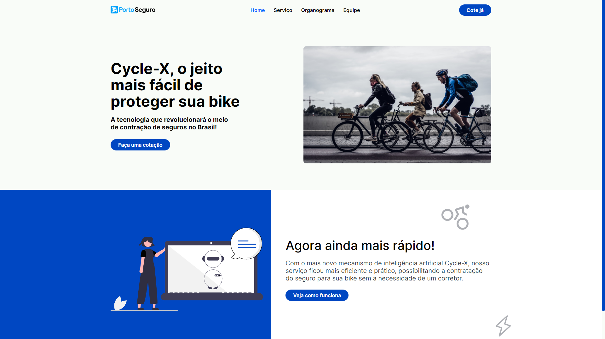

    <h2>⚜️ P O R T O &nbsp; S E G U R O &nbsp; B I K E S ⚜️</h2>

<h3 align="center">
    
     
    <a href="https://erickks.github.io/sp1-porto-web/">live demo</a>
</h3>

## 📚 Project

Academic project developed to solve a problem proposed by Porto company, emphasizing that this is still the first sprint of the Web Development component of this challenge.

 

## 🖥 Technologies

- [Html](https://www.w3schools.com/html/)
- [Css](https://www.w3schools.com/css/)
- [Javascript](https://www.javascripttutorial.net/)
